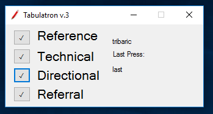
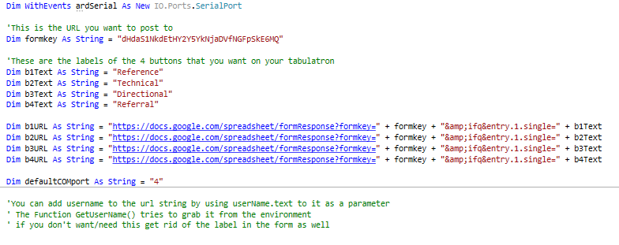

# Tabulatron

 

Tabulatron client in vb and in action!

## Basics
Takes an Arduino with 4 push buttons on it and posts the button presses to a Google Docs form. As seen in:

[Arduino-enabled Patron Interaction Counting - code4lib Journal](http://journal.code4lib.org/articles/8200) 

[Beyond Open Source Software: Solving Common Library Problems Using the Open Source Hardware Arduino Platform](https://journal.lib.uoguelph.ca/index.php/perj/article/view/2497/) 

Links above should give you the basics on what it does and the construction of the arduino device. 

*Descriptions of each top level folder*

### vb_version
This is a newly designed Visual Basic Implementation of the client software.
Once you open the project you need to localize by configuring the following variable names. Hopefully straight forward.

 

In this version it attempts to connect to the Arduino on COM port 4, default can be changed. Once it runs it writes out `COM.txt` with that value. Changing this text file to a different number will make the client use a different com port. Easy-Peasy.

### tabulatron
Contains processing sketch that draws desktop app that will monitor serial port
You'll need to configure:
- formkey
- revformkey
- btn0
- btn1
- btn2
- btn3
- port 
Instructions in file

### tab_ard
No real changes need to be made
Schematic
- Pushbutton on A0
- Pushbutton on A1
- Pushbutton on A2
- Pushbutton on A3
- Led on 13

### tab_ard_5
Arduino sketch for a  5 button version I was workin on

### pyTabulatron
A desktop client written in Python 2.x and Tinker

### pyTab5
A desktop client written in Python 2.x and Tinker for the 5 button version

Hopefully easy enough to figure out!

enjoy
tim (tim @ elibtronic.ca)